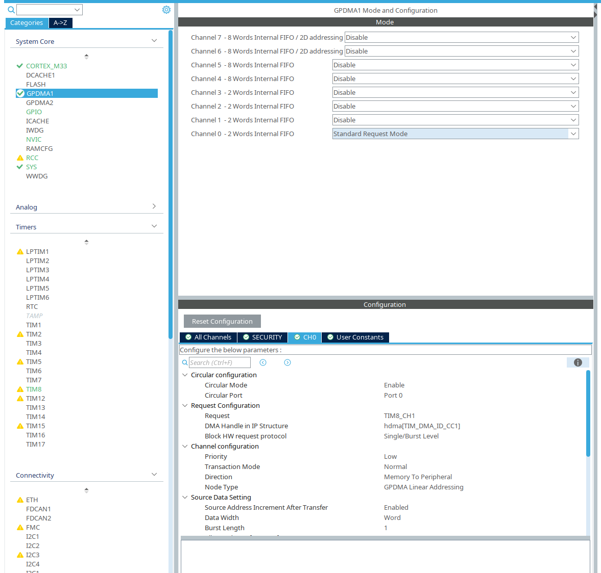
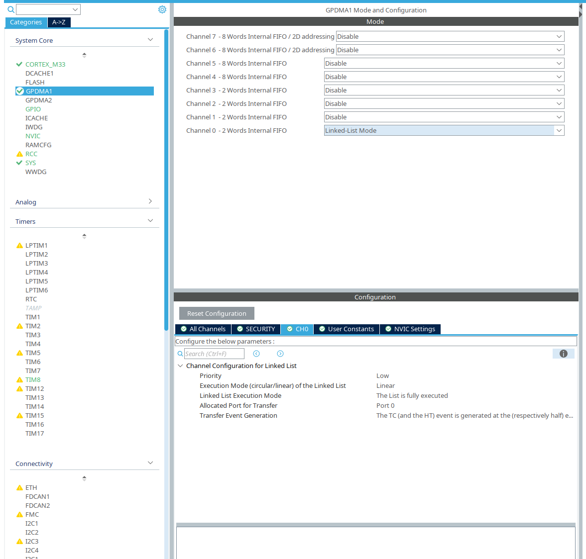

# stm32h5-rgb-led

This is a quick simple repo to illustrate how the GPDMA on the STM32H5 and U5 work with respect to timers. Namely RGB LED strips.

This example is for the STM32H563-NUCLEO board. The pin to control the LED strip is pin PC6

# why make this? there are so many RGB LED tutorials out there.

A coworker and I were working on a new device that needed to control 350-odd WS2812 RGB LED's, so DMA made sense. However, for whatever reason, there isn't much in the way of example code on how to use the DMA with timers on these newer chips, and the examples for the DMA in general aren't as helpful as one would think. So while we were flailing for a day or two to figure out that documentation, we figured that once we finally got it we'd have to upload *something* to github so that we spare others the headache. So here's a little SEO spam so people find it on google someday:

STM32H5
STM32U5
GPDMA RGB LED
WS2812
GPDMA PWM

# why the fancy new dma is misleading

The major difference between the H5/U5 and older chips (namely the STM32F1/2/3/4/7-series) is that the H5/U5 use something called "GPDMA" which is ST's fancy new DMA engine. It's *deceptively* similar to the old DMA, but with some notable differences.

The documentation specifies that the GPDMA has two overall "modes":
- Standard Request Mode (legacy DMA implementation)
    - this is also known as "direct programming mode" in the reference manual (RM0481)
    - this mode is typically what we understand for DMA if you've worked with STM32 chips before
- Linked List Mode
    - for specifying a DMA channel as a list of transfers (the items in the linked list)
    - It also appears to be mainly for memory-to-memory transfers rather than memory-to-peripheral

And a secret third mode: "Circular Mode"

The documentation isn't always clear what "linked list mode" means. In RM0481 chapter 16 it appears that standard request mode and linked list mode are distinct. In the DMA application guide AN5593, it's specified that all transfers are linked lists (in section 2.1), but in the very same document it's specified that you can't use linked-list mode for periperhals (section 3.5.4 for instance)

The documentation is also inconsistent about the idea of "Circular Mode". In RM0481 16.4.13, we see that circular mode is tied to linked-list mode, but if you try to activate circular and linked-list mode in STM32CubeIDE...

It's only available in Standard Request Mode?! What?!!!

# getting it to work the way you expect

For the vast majority of ST applications, you're going to be using the DMA for memory-to-peripheral and peripheral-to-memory, which is Standard Request Mode. The other thing you're likely going to be doing is filling a buffer with junk to be sent out a UART or timer PWM. That's where Circular Mode comes in. Circular Mode *is* the linked list you expect, where the data is read/written from a buffer to/from the memory over and over again. Standard Request Mode appears to be designed to do this by allowing multiple "bursts" of writing, but if you look at AN5593, it's clear that most of the peripherals can only be written to one burst at a time. See sections 3.4.2, 3.4.4, 3.4.5, 3.5.2, 3.5.3, etc.

AN5593 also does not mention Circular Mode *at all*, which is super unhelpful, as it's what you need to make the DMA work consistently.

# tl;dr

To get the DMA working the way you expect for memory-to-peripheral and peripheral-to-memory, use Standard Request Mode with Circular Mode transfer enabled. There are fancy things you can do with linked list mode (see the STM32H563 UART example), but this should be simpler.
